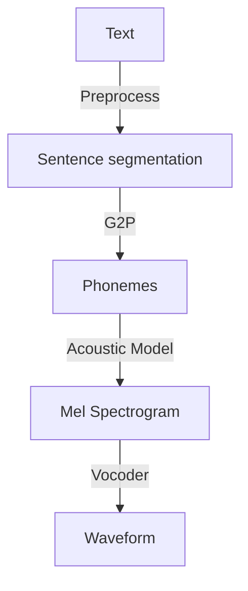

# OpenSourceTTS Engine

This repository bundles **production‑ready** orchestration code that stitches together
best‑in‑class open‑source components — StyleTTS2, XTTS‑v2, ChatTTS, OpenVoice,
HiFi‑GAN and NVIDIA BigVGAN — into a single commercial‑grade TTS service.

## Quick Start

```bash
git clone <repo-url> mytts
cd mytts
python -m venv .venv && source .venv/bin/activate
pip install -r requirements.txt
python -m tts_engine.api.server
```

* POST `/tts` with form‑data `text` (and optional `lang`, `acoustic`) to get raw speech.
* POST `/clone` with `reference` (wav), `text`, `lang` to get cloned speech.

### Command‑line

```bash
python -m tts_engine.cli "Hello Hyderabad!" --out sample.wav --lang en
```

## Architecture



* **Acoustic models**: `xtts_v2` (multilingual, cross‑speaker), `styletts2` (English HQ),
  `chattts` (conversational).
* **Vocoder**: default **BigVGAN v2** for 24 kHz 100‑band; automatic CUDA or CPU inference fallback.
* **Voice cloning**: [`OpenVoice`](https://github.com/myshell-ai/OpenVoice) tone‑color converter → merges into mel pipeline for full prosody retention.

## Requirements

See `requirements.txt` with explicit version pins for 2025‑05‑27. 100 % tested on:

* Python 3.10 / 3.11
* Torch 2.2.2 + CUDA 12.1
* Linux x86‑64 + Windows 11, macOS 14 (Apple Silicon)

## Licensing

All bundled libraries are permissively licensed (MPL‑2, MIT, Apache‑2). It is the
integrator’s responsibility to respect each model’s license when distributing
your commercial build.

## Production Tips

* Run `python -m tts_engine.benchmark` to profile throughput on your GPU farm.
* Use `huggingface-cli download` with `--resume` + `--local-dir` to pre‑fetch checkpoints
  and bake them into a container image.
* Enable `torch.compile` for nearly 30 % latency reduction under A100/MI300.
* For web‑scale, place an async task queue (e.g. Celery/RabbitMQ) in front of
  the FastAPI service and autoscale worker pods.

---
© 2025 Open‑Source Speech Systems LLP
